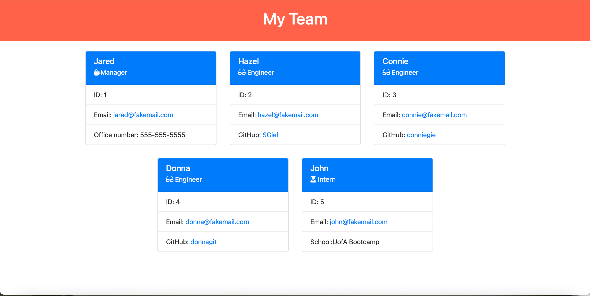

# Team Profile Generator 

## Description
  Generates a webpage that displays a company team's basic info so that the user has quick access to their emails and GitHub profiles.
  
  The user input is captured from the command line by first prompting for a manager, manager's name, id #, email address and office number.
  
  After the manager information is input, the user is asked if they would like to add an Engineer, Intern or whether they are done building their team. 
  
  If they choose an Engineer, the user is prompted to enter the Engineer's name, id, email, and GitHub username. After the Engineer is entered the user is again prompted as to whether they would like to enter another Engineer, Intern or if they are done building their team. 
  
  If they choose an Intern, the user is prompted to enter the Intern's name, id, email and school. After the Inter is entered the user is again prompted as to whether they would like to enter another Engineer, Intern or if they are done building their team.
  
  Once the user is finished building their team, an index.html file is generated that can be displayed as a webpage that contains the team member's information.

  Note that when the user clicks on the email address on the webpage it opens the user's default email program and populates the TO field with the email address. Also, when the user clicks on the GitHub username, the GitHub profile for that user opens in a new tab.

  This project utilizes Node.js and the Inquirer package for user input and the Jest package for testing.
 
  ## Screenshots of web application 

## Table of Contents

* [Installation](#installation)
* [Usage](#usage)
* [License](#license)
* [Tests](#tests)

## Installation
  Clone the repository to your terminal. Intall Node.js to your terminal. Install Inquirer package to the root of your project directory and then install the Jest package with npm i jest --save-dev

## Usage
  [Link to Team Profile Generator application walk-through video](https://drive.google.com/file/d/1tQAWhn-F7R6gVAzpEZTiO2_EDQFyxbqH/view) 

## License  
  
Licensed under the The MIT License (the "License");
you may not use this file except in compliance with the License.
You may obtain a copy of the License at

(https://opensource.org/licenses/MIT)

Unless required by applicable law or agreed to in writing, software
distributed under the License is distributed on an "AS IS" BASIS,
WITHOUT WARRANTIES OR CONDITIONS OF ANY KIND, either express or implied.
See the License for the specific language governing permissions and
limitations under the License.
  

## Tests
  Tests were performed on the constructor objects in this application, Employee, Manager, Engineer and Intern with the npm package Jest

    
